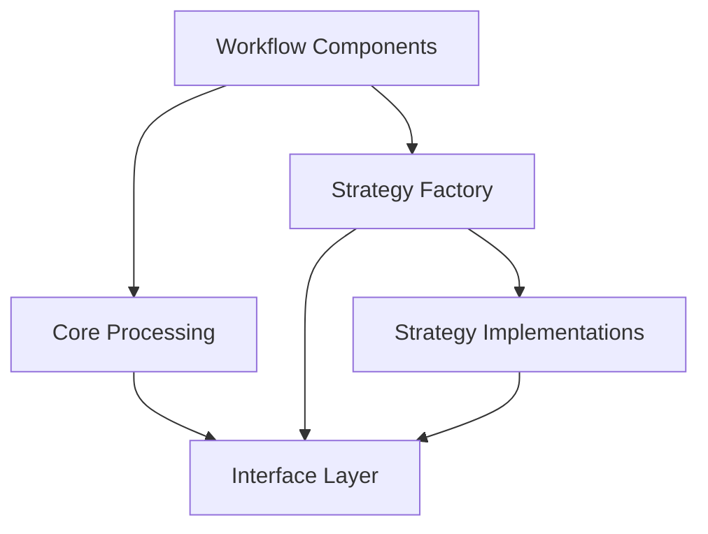
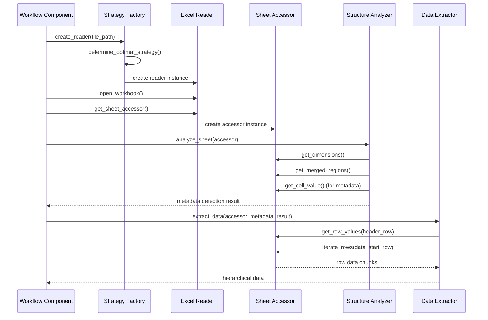

# Excel-to-JSON Processor: Technical Architecture and Implementation Analysis

## 1. System Overview and Technical Problem Statement

The Excel-to-JSON Processor implements a robust conversion mechanism for transforming complex Excel files with hierarchical data structures, merged cells, and metadata sections into structured JSON representations. The system's critical technical challenge involves resolving inherent inconsistencies between multiple Excel file access mechanisms while preserving complex structural relationships.

### 1.1 Technical Problem Identification

The principal architectural flaw in the original implementation manifests as XML parsing failures during data extraction, specifically:

```
ERROR - Failed to extract hierarchical data: [file-operation] Excel file not found: /xl/workbook.xml (file=/xl/workbook.xml)
```

Root cause analysis reveals a fundamental resource contention issue:

1. **Dual-Path Access Pattern**: The system employs two distinct Excel access mechanisms simultaneously:
   - `StructureAnalyzer` utilizes direct openpyxl access for structure and metadata analysis
   - `DataExtractor` invokes pandas for data transformation via `read_dataframe()`

2. **Conflicting Resource Management**: These mechanisms attempt to access the same XLSX file concurrently but employ incompatible ZIP archive navigation strategies, resulting in XML structure corruption

3. **Implementation-Specific Assumptions**: Each library makes differing assumptions about the internal XLSX file structure, leading to parsing failures when used in tandem

### 1.2 Technical Architecture Solution Matrix

| Architecture Component | Current Implementation | Critical Issue | Architectural Solution |
|------------------------|------------------------|----------------|------------------------|
| Excel File Access | Fragmented dual-path access | Resource contention | Unified access through abstraction layer |
| Structure Analysis | Direct openpyxl dependency | Tight coupling | Interface-based access with strategy selection |
| Data Extraction | Direct pandas dependency | Conflicting access pattern | Strategy-specific extraction with consistent interface |
| Resource Management | Implicit and uncoordinated | Handle conflicts | Explicit lifecycle with coordinated management |
| Type Conversion | Library-specific handling | Inconsistent semantics | Standardized conversion with interface contracts |

## 2. Architectural Design: Interface-Strategy Pattern Implementation

The redesigned architecture implements a rigorous application of the Interface-Strategy pattern with dependency inversion to eliminate resource contention while ensuring consistent behavior.

### 2.1 Architectural Component Hierarchy

```
excel_processor/
├── io/                  # Abstraction layer - NEW
│   ├── interfaces.py    # Core interface contracts
│   ├── strategy_factory.py  # Strategy selection mechanism
│   ├── strategies/      # Strategy implementations
│   │   ├── base_strategy.py     # Strategy interface
│   │   ├── openpyxl_strategy.py # Primary implementation
│   │   ├── pandas_strategy.py   # Alternative for large datasets
│   │   └── fallback_strategy.py # Resilient fallback
│   └── adapters/        # Migration enablers
│       └── legacy_adapter.py    # Legacy integration bridge
├── core/                # Processing components - MODIFIED
│   ├── reader.py        # Original implementation (to be replaced)
│   ├── structure.py     # Modified to use interfaces
│   └── extractor.py     # Modified to use interfaces
├── models/              # Domain models - UNCHANGED
├── output/              # Output formatting - UNCHANGED
├── utils/               # Cross-cutting concerns - UNCHANGED
└── workflows/           # Process orchestration - MODIFIED
```

### 2.2 Component Dependency Structure

The architecture enforces a strict dependency hierarchy that inverts traditional relationships:



This structure ensures that:
1. High-level processing components depend solely on abstractions
2. Low-level implementation details depend on the same abstractions
3. No component has direct dependencies on specific Excel libraries

### 2.3 Critical Interface Definitions

#### 2.3.1 `ExcelReaderInterface`

```python
class ExcelReaderInterface(ABC):
    """Primary interface for Excel workbook access operations."""
    
    @abstractmethod
    def open_workbook(self) -> None:
        """Initialize workbook access and prepare internal structures."""
        pass
        
    @abstractmethod
    def close_workbook(self) -> None:
        """Release file handles and resources deterministically."""
        pass
        
    @abstractmethod
    def get_sheet_names(self) -> List[str]:
        """Retrieve available worksheet identifiers."""
        pass
        
    @abstractmethod
    def get_sheet_accessor(self, sheet_name: Optional[str] = None) -> 'SheetAccessorInterface':
        """Obtain sheet-specific accessor instance."""
        pass
```

#### 2.3.2 `SheetAccessorInterface`

```python
class SheetAccessorInterface(ABC):
    """Interface for navigating worksheet structure and extracting data."""
    
    @abstractmethod
    def get_dimensions(self) -> Tuple[int, int, int, int]:
        """Retrieve sheet boundaries as (min_row, max_row, min_col, max_col)."""
        pass
        
    @abstractmethod
    def get_merged_regions(self) -> List[Tuple[int, int, int, int]]:
        """Identify merged cell regions as (top_row, left_col, bottom_row, right_col)."""
        pass
        
    @abstractmethod
    def get_cell_value(self, row: int, column: int) -> Any:
        """Extract individual cell value with type preservation."""
        pass
        
    @abstractmethod
    def get_row_values(self, row: int) -> Dict[int, Any]:
        """Extract complete row data as column-indexed dictionary."""
        pass
        
    @abstractmethod
    def iterate_rows(self, start_row: int, end_row: Optional[int] = None, 
                    chunk_size: int = 1000) -> Iterator[Dict[int, Dict[int, Any]]]:
        """
        Provide memory-efficient row iteration with chunking support.
        Returns: Iterator yielding {row_index: {column_index: value}} dictionaries
        """
        pass
```

## 3. Strategy Implementation Analysis

### 3.1 Strategy Selection Algorithm

The system employs a sophisticated strategy selection mechanism that analyzes file characteristics to determine the optimal access approach:

```python
def create_reader(self, file_path: str) -> ExcelReaderInterface:
    """Create the optimal reader implementation for the specified file."""
    try:
        # File characteristic analysis
        file_size = os.path.getsize(file_path)
        large_file = file_size > self.config.get("large_file_threshold", 50 * 1024 * 1024)
        complex_structure = self._detect_complex_structure(file_path)
        
        # Strategy priority determination based on characteristics
        if complex_structure:
            # Complex structures require direct openpyxl access
            strategies = ["openpyxl", "fallback"]
        elif large_file:
            # Large files benefit from pandas vectorization
            strategies = ["pandas", "openpyxl", "fallback"]
        else:
            # Default priority
            strategies = ["openpyxl", "pandas", "fallback"]
        
        # Attempt strategies in priority order
        for strategy_name in strategies:
            strategy = self._get_strategy_by_name(strategy_name)
            if strategy and strategy.can_handle_file(file_path):
                return strategy.create_reader(file_path)
        
        # If no suitable strategy found
        raise ValueError(f"No compatible strategy found for {file_path}")
    except Exception as e:
        # Transform to domain-specific exception
        raise ExcelProcessorError(f"Strategy selection failed: {str(e)}", 
                                  source="strategy_factory", 
                                  details={"file": file_path})
```

### 3.2 Primary Strategy Implementation: Openpyxl

The openpyxl strategy provides a comprehensive implementation of the interface contracts using direct workbook access:

```python
class OpenpyxlSheetAccessor(SheetAccessorInterface):
    """Sheet accessor implementation using direct openpyxl access."""
    
    def __init__(self, worksheet: Worksheet):
        """Initialize with openpyxl worksheet instance."""
        self.worksheet = worksheet
        self._cell_value_extractor = OpenpyxlCellValueExtractor()
        
    def get_dimensions(self) -> Tuple[int, int, int, int]:
        """Get sheet dimensions directly from worksheet properties."""
        return (
            self.worksheet.min_row,
            self.worksheet.max_row,
            self.worksheet.min_column,
            self.worksheet.max_column
        )
    
    def get_merged_regions(self) -> List[Tuple[int, int, int, int]]:
        """Extract merged regions from worksheet merged_cells collection."""
        return [
            (merged_range.min_row, merged_range.min_col, 
             merged_range.max_row, merged_range.max_col)
            for merged_range in self.worksheet.merged_cells.ranges
        ]
    
    def get_cell_value(self, row: int, column: int) -> Any:
        """Extract cell value with type preservation."""
        cell = self.worksheet.cell(row, column)
        return self._cell_value_extractor.extract_value(cell)
        
    def iterate_rows(self, start_row: int, end_row: Optional[int] = None, 
                    chunk_size: int = 1000) -> Iterator[Dict[int, Dict[int, Any]]]:
        """Implement chunked row iteration for memory efficiency."""
        # Implementation details omitted for brevity
```

### 3.3 Alternative Strategy Implementation: Pandas

The pandas strategy utilizes vectorized operations for optimal performance with large datasets:

```python
class PandasSheetAccessor(SheetAccessorInterface):
    """Sheet accessor implementation using pandas DataFrame operations."""
    
    def __init__(self, df: pd.DataFrame, sheet_name: str, excel_file: str):
        """Initialize with DataFrame and metadata."""
        self.df = df
        self.sheet_name = sheet_name
        self.excel_file = excel_file
        
    # Implementation details omitted for brevity
```

### 3.4 Migration Strategy: Legacy Adapter

The legacy adapter enables gradual migration by bridging old and new architectures:

```python
class LegacyReaderAdapter(ExcelReaderInterface):
    """Adapter bridging legacy ExcelReader to new interface architecture."""
    
    def __init__(self, file_path: str):
        """Initialize with legacy reader instance."""
        from excel_processor.core.reader import ExcelReader
        self.legacy_reader = ExcelReader(file_path)
        self.file_path = file_path
        
    def open_workbook(self) -> None:
        """Delegate to legacy load_workbook method."""
        self.legacy_reader.load_workbook()
        
    # Implementation details omitted for brevity
```

## 4. Data Transformation Process Analysis

### 4.1 Data Extraction Flow

The Excel-to-JSON conversion process follows a precise sequence of operations, now unified through the interface layer:



### 4.2 Hierarchical Data Extraction Mechanics

The system employs sophisticated algorithms to detect parent-child relationships from Excel's merged cell structure, enabling accurate modeling of hierarchical data:

| Excel Structure | Detection Mechanism | Hierarchical Representation |
|-----------------|---------------------|----------------------------|
| Vertical Merged Cells | Cells merged vertically across multiple rows | Parent nodes in the hierarchy |
| Horizontal Adjacency | Cells to the right of vertical merged cells | Child nodes of the merged cell |
| Nested Vertical Merges | Vertically merged cells at different column positions | Multiple hierarchy levels |
| Horizontal Merged Cells | Cells merged horizontally across multiple columns | Compound values at the same hierarchy level |

### 4.3 Excel-to-JSON Type Conversion Matrix

Consistent type conversion is critical for accurate JSON representation:

| Excel Data Type | Type Detection Mechanism | JSON Representation | Implementation Approach |
|-----------------|--------------------------|---------------------|------------------------|
| Text | Cell.data_type == 's' | JSON string | Direct string conversion with encoding preservation |
| Number | Cell.data_type == 'n' | JSON number | Native numeric conversion with precision maintenance |
| Integer | is_integer(cell.value) | JSON integer | Integer conversion for whole numbers |
| Floating Point | not is_integer(cell.value) | JSON decimal | Decimal conversion with original precision |
| Boolean | Cell.data_type == 'b' | JSON boolean | Direct boolean conversion |
| Date/Time | isinstance(cell.value, datetime) | JSON string (ISO-8601) | ISO-8601 format with TZ normalization |
| Formula | Cell.data_type == 'f' | Based on result type | Extract calculated value, not formula |
| Empty | Cell.value is None | null or omitted | Configurable handling based on include_empty flag |
| Error | Cell.data_type == 'e' | null | Error suppression with optional logging |

## 5. Performance Optimization Strategies

### 5.1 Memory Management Techniques

The architecture implements multiple memory optimization approaches:

| Technique | Implementation Mechanism | Memory Impact | Component Location |
|-----------|--------------------------|---------------|-------------------|
| Chunked Processing | Row iterator with configurable chunk size | Bounds maximum memory usage | SheetAccessorInterface.iterate_rows() |
| Lazy Loading | On-demand sheet access | Minimizes concurrent resource usage | ExcelReaderInterface.get_sheet_accessor() |
| Resource Lifecycle | Explicit open/close semantics | Deterministic resource release | ExcelReaderInterface lifecycle methods |
| Typed Value Extraction | Direct value extraction without intermediary transforms | Reduces object duplication | CellValueExtractorInterface implementations |
| Structural Reference | Position references instead of value duplication | Minimizes redundant data storage | MergeInfo and hierarchical structures |

### 5.2 Computational Optimization Techniques

The system employs specialized computational optimizations:

| Technique | Implementation Mechanism | Performance Impact | Applicable Scenarios |
|-----------|--------------------------|-------------------|----------------------|
| Strategy Selection | File characteristic analysis | Optimizes access pattern for file type | All file processing |
| Vectorized Operations | Pandas-based implementation for regular data | Accelerates large dataset processing | Large tabular datasets |
| Index-Based Access | Direct cell access by coordinates | Minimizes traversal overhead | Complex structured sheets |
| Merge Region Mapping | Spatial index of merged cells | Reduces lookup complexity | Sheets with many merged cells |
| Parallel Processing | Thread pool for batch operations | Increases throughput for multiple files | Batch directory processing |
| Result Caching | Hash-based caching of processing results | Eliminates redundant processing | Unchanged files in batch processing |

## 6. Implementation Migration Pathway

### 6.1 Implementation Sequence Matrix

The implementation should proceed according to this dependency-ordered sequence:

| Phase | Component | Technical Dependencies | Validation Criteria | Priority |
|-------|-----------|----------------------|---------------------|----------|
| 1 | interfaces.py | None | Interface contract completeness | Critical |
| 2 | base_strategy.py | interfaces.py | Strategy protocol definition | Critical |
| 3 | openpyxl_strategy.py | interfaces.py, base_strategy.py | XML parsing resolution | Critical |
| 4 | strategy_factory.py | base_strategy.py | Selection algorithm correctness | High |
| 5 | legacy_adapter.py | interfaces.py, core/reader.py | Backward compatibility | High |
| 6 | Core refactoring | interfaces.py | Functional equivalence | Medium |
| 7 | pandas_strategy.py | interfaces.py, base_strategy.py | Large file optimization | Medium |
| 8 | fallback_strategy.py | interfaces.py, base_strategy.py | Error resilience | Low |

### 6.2 Testing Strategy Matrix

Each component requires specific testing approaches:

| Component | Test Type | Test Focus | Validation Technique |
|-----------|-----------|------------|----------------------|
| Interface Layer | Unit Tests | Contract Completeness | Interface implementation verification |
| Strategy Implementations | Integration Tests | Excel File Compatibility | File parsing with varied structures |
| Strategy Factory | Logic Tests | Selection Algorithm | Decision tree validation |
| Legacy Adapter | Compatibility Tests | Behavior Preservation | Result comparison with original code |
| Refactored Core | Regression Tests | Functional Equivalence | Input/output comparison |

### 6.3 Configuration Extension Requirements

The system requires configuration extensions to support strategy selection:

```python
{
    # Original configuration parameters
    "metadata_max_rows": 6,
    "header_detection_threshold": 3,
    "include_empty_cells": False,
    "chunk_size": 1000,
    
    # New strategy selection parameters
    "excel_access": {
        "preferred_strategy": "auto",  # "auto", "openpyxl", "pandas", "fallback"
        "large_file_threshold_mb": 50,  # File size threshold for pandas strategy
        "enable_fallback": True,  # Whether to try fallback strategy on failure
        "complex_structure_detection": True,  # Whether to detect complex structures
    }
}
```

## 7. Technical Decision Analysis and Rationale

### 7.1 Key Architectural Decisions

| Decision Point | Selected Approach | Technical Rationale | Alternative Considered |
|----------------|-------------------|---------------------|------------------------|
| Access Abstraction | Interface-Strategy Pattern | Enables dynamic implementation selection while maintaining consistent contracts | Adapter Pattern (rejected due to limited flexibility) |
| Primary Implementation | Openpyxl-Based Strategy | Direct XML structure access necessary for complex merged cells | Pandas-only (rejected due to limited merged cell support) |
| Resource Management | Explicit Lifecycle Methods | Ensures deterministic resource acquisition and release | Implicit Context Managers (rejected due to reduced control) |
| Backward Compatibility | Legacy Adapter Bridge | Enables gradual migration without disrupting existing code | Complete Rewrite (rejected due to implementation risk) |
| Type Handling | Interface-Defined Conversion | Ensures consistent type semantics across strategies | Strategy-Specific Handling (rejected due to inconsistency risk) |

### 7.2 Technical Trade-Off Analysis

| Trade-Off Area | Approach Selected | Advantage | Disadvantage | Mitigation Strategy |
|----------------|-------------------|-----------|--------------|---------------------|
| Performance vs. Flexibility | Balanced Approach | Supports multiple access strategies | Slight overhead from abstraction | Optimized strategy selection |
| Memory vs. Speed | Chunked Processing | Bounded memory usage | Slightly increased processing time | Configurable chunk size |
| Compatibility vs. Optimization | Interface Abstraction | Unified access interface | Some optimizations limited by interface | Strategy-specific optimizations within interface |
| Immediate Fix vs. Long-term Architecture | Balanced Approach | Immediate XML parsing resolution | More implementation effort | Legacy adapter for transition |

## 8. Conclusion and Technical Recommendations

The Excel-to-JSON Processor architecture resolves the critical XML parsing failure through systematic application of design principles that eliminate resource contention. By implementing a robust abstraction layer with the Interface-Strategy pattern, the system achieves:

1. **Resource Contention Elimination**: Unified access through a single strategy instance prevents conflicting file handle operations
2. **Consistent Type Handling**: Interface-defined conversion rules ensure semantic consistency
3. **Memory Optimization**: Chunked processing with explicit lifecycle management optimizes resource usage
4. **Implementation Flexibility**: Strategy pattern enables selection of optimal implementation based on file characteristics
5. **Migration Pathway**: Legacy adapter facilitates gradual transition without disrupting existing functionality

Technical implementation should proceed according to the specified dependency sequence, with comprehensive testing at each phase to ensure functional equivalence and performance optimization. The resulting architecture will not only resolve the immediate XML parsing issue but establish a more robust and extensible foundation for future development.
